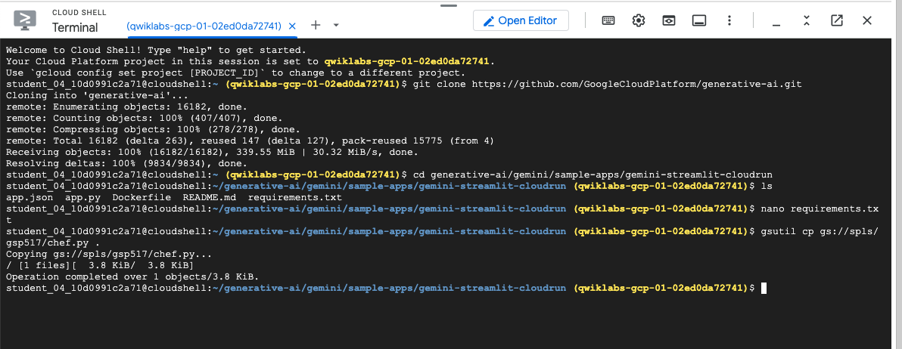
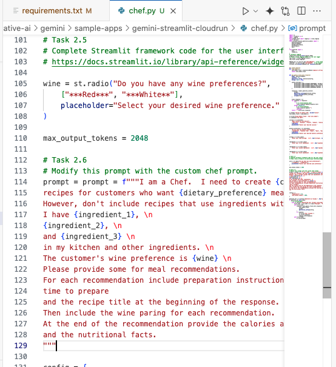

# GCP-Challenge-Lab-Develop-GenAI-Apps-with-Gemini-and-Streamlit
Challenge-Lab: Develop GenAI Apps with Gemini and Streamlit


#### Overview
In a challenge lab you’re given a scenario and a set of tasks. Instead of following step-by-step instructions, you will use the skills learned from the labs in the course to figure out how to complete the tasks on your own! An automated scoring system (shown on this page) will provide feedback on whether you have completed your tasks correctly.

When you take a challenge lab, you will not be taught new Google Cloud concepts. You are expected to extend your learned skills, like changing default values and reading and researching error messages to fix your own mistakes.

To score 100% you must successfully complete all tasks within the time period!

This lab is recommended for students who enrolled in the GenAI application development with Gemini and Streamlit course. Are you ready for the challenge?


###### Challenge scenario

You onboarded at Cymbal Health just a few months ago. Cymbal Health is an established health network in East Central Minnesota dedicated to reimagining and transforming the way that healthcare can be delivered. Cymbal Health connects care and coverage under one health plan to make it easier for patients to receive high quality care at an affordable cost.

As a value added service, Cymbal Health is interested in improving customer Healthy Living and Wellness, with tips, and advice within apps. One particular area they want to focus on is improving customer nutrition.


By harnessing the power of the Gemini, a multimodal model for generating text, audio, images, and video, Cymbal Health can build applications that generate meal recommendations for its customers.

As an example, your team has been working to create a AI-Based Chef app, that generates recipes based upon customer cuisine preferences, dietary restrictions, food allergies, and what they typically have in their homes or can purchase at a grocery store. Your job is to build, test and deploy a Proof Of Concept (POC) for this Chef app built on the Gemini model, Streamlit framework, and Cloud Run. As part of this POC, they have a list of tasks they would like to see you do in an allotted period of time in a sandbox environment.

##### Your challenge

Your tasks include the following:

. Use cURL to test a prompt with the API.
. Write Streamlit framework and prompt Python code to complete chef.py.
. Test the application.
. Modify the Dockerfile and push the Docker image to the Artifact Registry.
. Deploy the application to Cloud Run and test.


### Task 1. Use cURL to test a prompt with the API

Before you can begin to create the Chef app in Vertex AI, you should test connectivity with the Gemini API.

1. In the Google Cloud console, on the Navigation menu (Navigation menu icon), click Vertex AI > Workbench.

2. Find the generative-ai-jupyterlab instance and click on the Open JupyterLab button.

The JupyterLab interface for your Workbench instance opens in a new browser tab.


3. From the left hand menu, modify prompt.ipynb to include your project_ID and region within cell 3. You can get these in the left panel of the lab instructions.

4. From the left hand menu, modify prompt.ipynb to use the following prompt with cURL within cell 5, by replacing the existing prompt.

```
I am a Chef.  I need to create Japanese recipes for customers who want low sodium meals. However, I do not want to include recipes that use ingredients associated with a peanuts food allergy. I have ahi tuna, fresh ginger, and edamame in my kitchen and other ingredients. The customer wine preference is red. Please provide some for meal recommendations. For each recommendation include preparation instructions, time to prepare and the recipe title at the beginning of the response. Then include the wine paring for each recommendation. At the end of the recommendation provide the calories associated with the meal and the nutritional facts.
```
5. Run all cells and observe the results.

6. Save prompt.ipynb.


```
! pip3 install --upgrade --user google-cloud-aiplatform
```

```
import IPython
app = IPython.Application.instance()
app.kernel.do_shutdown(True)
```

>{'status': 'ok', 'restart': True}


```
# Modify these variables to include your project ID and region.
PROJECT_ID = "qwiklabs-gcp-04-a32ffadfd99f"
LOCATION = "europe-west4"
```

```
import os

os.environ["PROJECT_ID"] = PROJECT_ID
os.environ["LOCATION"] = LOCATION
os.environ["API_ENDPOINT"] = f"{LOCATION}-aiplatform.googleapis.com"
```

```
%%bash

# Task 1.4
# Use cURL to test a prompt with the API, by modifying prompt with the prompt from the lab guide.

MODEL_ID="gemini-2.0-flash-001"

curl -X POST \
  -H "Authorization: Bearer $(gcloud auth print-access-token)" \
  -H "Content-Type: application/json" \
  https://${API_ENDPOINT}/v1/projects/${PROJECT_ID}/locations/${LOCATION}/publishers/google/models/${MODEL_ID}:streamGenerateContent \
  -d '{
    "contents": {
      "role": "USER", 
      "parts": { "text": "I am a Chef.  I need to create Japanese recipes for customers who want low sodium meals. However, I do not want to include recipes that use ingredients associated with a peanuts food allergy. I have ahi tuna, fresh ginger, and edamame in my kitchen and other ingredients. The customer wine preference is red. Please provide some for meal recommendations. For each recommendation include preparation instructions, time to prepare and the recipe title at the beginning of the response. Then include the wine paring for each recommendation. At the end of the recommendation provide the calories associated with the meal and the nutritional facts." }
    }
  }'
```


### Task 2. Write Streamlit framework and prompt Python code to complete chef.py

For this task you will clone a GitHub repo, and download the chef.py file. Then you will add Streamlit framework code in the chef.py file for the wine preference, to complete the user interface for the application. You will also include a custom Gemini prompt (similar to the one in task 1), but this one includes variables.

1. Using Cloud Shell clone the repo below from the default directory.

`git clone https://github.com/GoogleCloudPlatform/generative-ai.git`

2. Navigate to the gemini-streamlit-cloudrun directory.

`cd generative-ai/gemini/sample-apps/gemini-streamlit-cloudrun`



3. Specify the dependencies in the requirements.txt file:

```
google-cloud-logging
google-cloud-aiplatform
```


>Important: All work in this challenge lab should be done within this directory. If you do not download the chef.py file here and make changes to it here, it will not be able to access the Streamlit framework. You will also not be able to test it in Cloud Shell (Task 3), or build the docker container (Task 4), and deploy then test it Cloud Run (Task 5).

4. Download the chef.py file using the following command.

`gsutil cp gs://spls/gsp517/chef.py .`

5. Open the chef.py file in the Cloud Shell Editor and review the code.

>Note: The chef.py file already includes the Streamlit framework user interface code for the cuisine, dietary_preference, allergy, ingredient_1, ingredient_2, and ingredient_3 variables. Review this interface code before completing the next step.

6. Add Streamlit framework radio button option for the wine variable. Include options for Red, White and None.

```
wine = st.radio("Do you have any wine preferences?", 
	["***Red***", "***White**"],
)
```


7. Add the new Gemini prompt below in Python code.
```
prompt = f"""I am a Chef.  I need to create {cuisine} \n
recipes for customers who want {dietary_preference} meals. \n
However, don't include recipes that use ingredients with the customer's {allergy} allergy. \n
I have {ingredient_1}, \n
{ingredient_2}, \n
and {ingredient_3} \n
in my kitchen and other ingredients. \n
The customer's wine preference is {wine} \n
Please provide some for meal recommendations.
For each recommendation include preparation instructions,
time to prepare
and the recipe title at the beginning of the response.
Then include the wine paring for each recommendation.
At the end of the recommendation provide the calories associated with the meal
and the nutritional facts.
"""
```



8. Save the chef.py file.

Once you are satisfied with the Gemini prompt code you added in chef.py, upload the file to qwiklabs-gcp-04-a32ffadfd99f-generative-ai bucket by running below command in your cloud shell. On cloud console, click Open terminal to open the session in the Cloud Shell.

`gcloud storage cp chef.py gs://qwiklabs-gcp-04-a32ffadfd99f-generative-ai/`


### Task 3. Test the application

For this task you will use the terminal in Cloud Shell to run and test your application.

Make sure your are still in this path, generative-ai/gemini/sample-apps/gemini-streamlit-cloudrun.

Setup the python virtual environment and install the dependencies.


Set environment variables for PROJECT (as your Project ID) and REGION (as the region you are using in the lab environment).

Run the chef.py application and test it.

Once you tested the application in Cloud Shell and confirmed it is performing as designed, without errors, verify the objective.


 ```
   streamlit run app.py \
     --browser.serverAddress=localhost \
     --server.enableCORS=false \
     --server.enableXsrfProtection=false \
     --server.port 8080
```


### Task 4. Modify the Dockerfile and push image to the Artifact Registry

In this task you modify the sample Dockerfile to use your chef.py file and push the Docker image to the Artifact Registry.

>Important: Before completing the steps in this task we recommend you set environment variables for PROJECT (as your Project ID) and REGION (as the region you are using in the lab environment) as you did in a previous task.

1. Use the Cloud Shell editor to modify the Dockerfile to use chef.py, then save the file.

2. In Cloud Shell set the following environment variables.

| Variable	| Value |
| AR_REPO	| 'chef-repo' |
| SERVICE_NAME | 'chef-streamlit-app' |

>Note: We recommend you combine this command and the following two commands as a single command, as the process to create the Artifact Registry and submit the build to Cloud Build, takes approximately 8 minutes.

3. Create the Artifact Registry repository with the gcloud artifacts repositories create command and the following parameters.

| Parameter | Value |
| repo name	| $AR_REPO |
| location | $REGION |
| repository format	| Docker |

4. Submit the build with the gcloud builds submit command and the following parameters.

| Parameter | Value |
| tag | "$REGION-docker.pkg.dev/$PROJECT/$AR_REPO/$SERVICE_NAME" |

5. Wait for the command to complete.

```
gcloud artifacts repositories create "$AR_REPO" --location="$GOOGLE_CLOUD_REGION" --repository-format=Docker
gcloud builds submit --tag "$GOOGLE_CLOUD_REGION-docker.pkg.dev/$GOOGLE_CLOUD_PROJECT/$AR_REPO/$SERVICE_NAME"
```


### Task 5. Deploy the application to Cloud Run and test

In this task you deploy the application (as a Docker Artifact) to Cloud Run and then test the application as running from the Cloud Run service endpoint.

1. In Cloud Shell deploy the application (as a Docker Artifact), using gcloud run deploy command and the following parameter values:

| Parameter	| Value |
| port	| 8080 |
| image	| "$REGION-docker.pkg.dev/$PROJECT/$AR_REPO/$SERVICE_NAME" |
| flag | --allow-unauthenticated |
| region | REGION |
| platform | managed |
| project | PROJECT |
| set-env-vars | PROJECT=$PROJECT,REGION=$REGION |


```
gcloud services enable aiplatform.googleapis.com
```


```
   gcloud run deploy "$SERVICE_NAME" \
  --port=8080 \
  --image="$GOOGLE_CLOUD_REGION-docker.pkg.dev/$GOOGLE_CLOUD_PROJECT/$AR_REPO/$SERVICE_NAME" \
  --allow-unauthenticated \
  --region=$GOOGLE_CLOUD_REGION \
  --platform=managed  \
  --project=$GOOGLE_CLOUD_PROJECT \
  --set-env-vars=GOOGLE_CLOUD_PROJECT=$GOOGLE_CLOUD_PROJECT,GOOGLE_CLOUD_REGION=$GOOGLE_CLOUD_REGION
```


> Note: You may see a prompt asking "Do you want enable these APIs to continue (this will take a few minutes)?" If you do, select Y for yes.

The deployment will take a few minutes to complete and you will be provided a URL to the Cloud Run service. You can visit that in the browser to view the Cloud Run application that you just deployed.

2. Test the application with the link provided.


Congratulations!

By completing this challenge lab, you verified your skills with Gen AI application development with Gemini and how you can apply these to AI based chef application.

